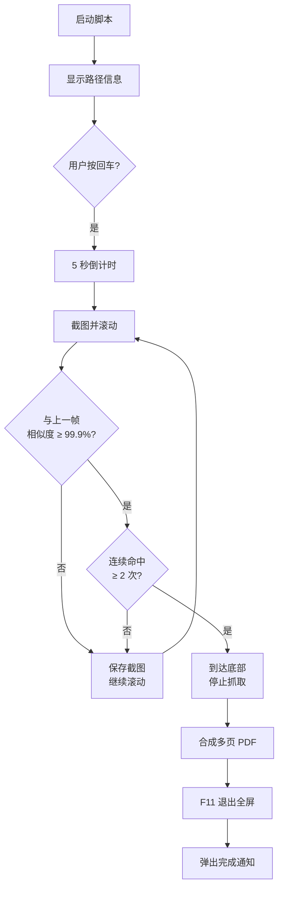

# 网页抓取工具 / Web Page Capture Tool

一款基于屏幕截图的自动化网页内容抓取工具，可将滚动网页完整保存为 PDF 文件。适用于无法直接下载、复制或导出的网页内容。

## 适用场景

- 无法下载的 PDF 预览页
- 禁止复制的文档网站
- 付费才能导出的长图文章
- 任何需要将网页完整保存为 PDF 的场景

## 功能特性

- **全自动滚动截图** — 自动向下滚动网页并逐屏截图
- **智能底部检测** — 通过连续两帧截图相似度（阈值 99.9%）自动判断页面底部
- **一键合成 PDF** — 将所有截图合并为一个多页 PDF 文件
- **动态文件名** — 按 `网页抓取_YYYYMMDD_HHMMSS.pdf` 格式自动命名，避免覆盖
- **防误触机制** — 按回车键后才开始倒计时，杜绝抢跑
- **倒计时准备** — 5 秒倒计时，预留切换窗口和进入全屏的时间
- **自动退出全屏** — 任务完成后自动按 F11 退出全屏
- **完成通知** — 弹出 Windows 原生提示框告知保存路径
- **安全中断** — 支持 Ctrl+C 手动中断抓取

## 环境要求

| 依赖 | 说明 |
|------|------|
| Python ≥ 3.6 | 运行环境 |
| pyautogui | 屏幕截图与自动化控制 |
| Pillow (PIL) | 图像比较与 PDF 合成 |
| Windows | 依赖 `ctypes` 原生弹窗（`user32.MessageBoxW`） |

## 安装

```bash
pip install pyautogui pillow
```

## 使用方法

1. **运行脚本**

   ```bash
   python 网页抓取工具physical_capture_tool.py
   ```

2. **按提示操作**

   - 确认脚本显示的路径信息无误
   - 按下 **回车键** 启动任务
   - 5 秒倒计时内，切换到目标网页并按 **F11** 进入全屏
   - 用鼠标点击网页中心以激活键盘焦点

3. **等待完成**

   - 脚本自动滚动并截图，检测到页面底部后自动停止
   - 自动合成 PDF 并保存至桌面
   - 自动按 F11 退出全屏，并弹出完成通知

## 参数说明

核心参数位于 `start_mission()` 函数内，可按需调整：

| 参数 | 默认值 | 说明 |
|------|--------|------|
| `scroll_amount` | `-h * 0.9` | 每次滚动的像素距离（负值表示向下），`h` 为屏幕高度 |
| `time.sleep(1.2)` | 1.2 秒 | 每次滚动后的等待时间，用于等待页面渲染 |
| `similarity ≥ 0.999` | 99.9% | 连续两帧相似度阈值，超过则判定为页面底部 |
| `stop_count ≥ 2` | 连续 2 次 | 确认到底所需的连续命中次数，防止误判 |

## 工作原理



## 输出文件

- **保存位置**: 桌面
- **命名格式**: `网页抓取_YYYYMMDD_HHMMSS.pdf`
- **文件格式**: 多页 PDF

## 注意事项

- 仅支持 **Windows** 系统（依赖 `ctypes` 弹窗 API）
- 抓取期间请勿移动鼠标或切换窗口，以免影响截图内容
- 请确保网页内容已完全加载后再启动
- 可通过 `pyautogui.FAILSAFE = True`（默认启用）将鼠标移到屏幕左上角紧急中断
- 对于动态加载（懒加载）的网页，建议适当增加 `scroll_amount` 或 `time.sleep` 时长

## 许可

本项目仅供个人学习与合法用途使用。请遵守目标网站的著作权及相关法律法规。
